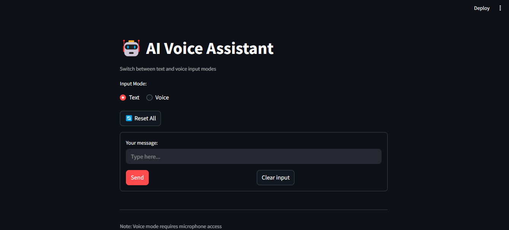
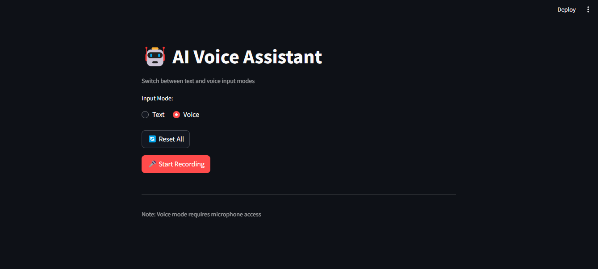

# AI Voice Assistant

A conversational AI Voice Assistant that supports both text and voice input/output.

# Demo Screenshot

- **Text Input Mode**:


- **Voice Input Mode**:


## Features

- **Dual Input Modes(User's Choice)**:
  - Text input via keyboard
  - Voice input via microphone
- **Text Output**: Text-to-text responses
- **Voice Output**: Text-to-speech responses
- **Smart Formatting**: Ensures paragraph-only responses from AI
- **Session Management**: Maintains conversation context
- **Responsive UI**: Clean Streamlit interface

## Prerequisites

- Python 3.8+
- Google Gemini API key
- Microphone (for voice mode)
- Speakers/headphones (for voice output)
  

## Installation

1. Clone the repository:
   ```bash
   git clone https://github.com/yourusername/ai-voice-assistant.git
   cd ai-voice-assistant
   ```

2. Install dependencies:
   ```bash
   pip install -r requirements.txt
   ```

3. Create a `.env` file in the project root and add your Gemini API key:
   ```env
   GEMINI_API_KEY=your_api_key_here
   ```

## Usage

1. Run the application:
   ```bash
   streamlit run main.py
   ```

2. In the browser:
   - Select your preferred input mode (Text or Voice)
   - For text mode: Type your message and click "Send"
   - For voice mode: Click "Start Recording" and speak
   - Click "Speak Response" to hear the AI's reply
   - Use "Reset All" to clear the conversation

## Configuration Options

You can modify these in `main.py`:
- Speech rate (words per minute)
- AI response length (max tokens)
- Creativity level (temperature)
- Microphone timeout settings

## Troubleshooting

**Voice Input Issues:**
- Ensure microphone access is granted
- Check background noise levels
- Increase `timeout` in `get_voice_input()` if needed

**API Errors:**
- Verify your Gemini API key is valid
- Check your internet connection
- Ensure you have sufficient quota


## Acknowledgments

- Google Gemini API
- Streamlit for the web interface
- SpeechRecognition library
- pyttsx3 for text-to-speech

